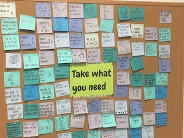
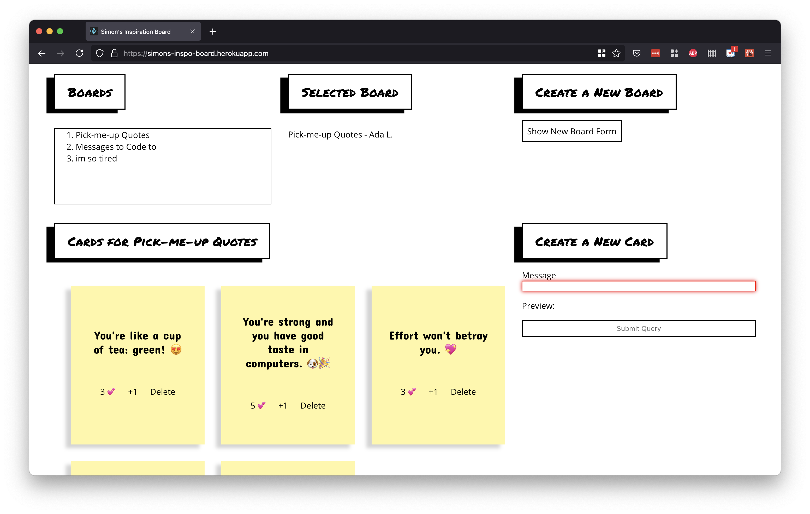
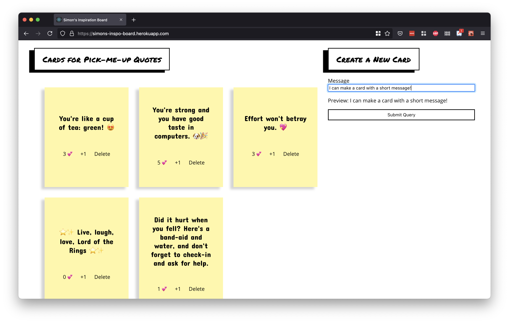

# Full-Stack Inspiration Board

## Skills Assessed

- Following directions and reading comprehension
- Using git as part of the development workflow
- Demonstrating interaction between front-end layer and back-end layer
- Applying deployment practices
- Practice independent research

Working with the Flask framework:

- Creating models
- Creating conventional RESTful CRUD routes for a model
- Create unconventional routes for custom behavior
- Apply knowledge about environment variables
- Creating a one-to-many relationship between two models

Working with the React JS library:

- Sending data to nested components through `props`
- Receiving and using `props` within a component
- Initializing and using state within a component
- Passing callback functions to child components and use them to update state

## Goal

Once upon a time, there existed an Ada Developers Academy office with an inspiration board...

It was a delightful board, where people could anonymously post short messages of encouragement to each other. It was filled with the kindest words and the nerdiest programming jokes.

  
_Fig. A corkboard full of pinned sticky notes, where each sticky note has a short, inspirational message._

Our goal is to create a digital inspiration board.

Users should be able to create one or more boards.

Then, a user can select a single board. When a user selects a board, they can see all the cards associated with that board.

Users can even "+1" the cards that they agree with!

We will use this project as a chance to see how the front-end layer and back-end layer interact. This is also an opportunity to bring some creativity to the UI.

### Demo

[An example implementation of the project is deployed on Heroku](https://simons-inspo-board.herokuapp.com/). This demonstrates only one way that a project could look.

(This app may take a long time to load, so you may need to refresh it periodically.)

  
_Fig. This example displays a list of boards, the name of a selected board (if there is one), and a form to create a new board._

  
_Fig. This example displays all cards that belong to a board, once a selected board has been chosen._

  
_Fig. This example has a section of cards. Each card has a message, the number of "likes," a button to add the like, and a button to delete the card._

## How to Complete and Submit

At submission time, no matter where your group is, submit the project via Learn.

You and your group will submit the following materials:

1. The team name
1. The name of the team's public Slack channel
1. A URL to the group front-end repo
1. A URL to the group back-end repo
1. A URL to the deployed front-end
1. A URL to the deployed back-end
1. A group presentation slide deck

The group will also give a final presentation. Presentation requirements are listed below.

## Getting Started

1. As a group, create a team name (this is important for instructors)
1. Create a public Slack channel for the team. This is **required** in order to fulfill the required project development workflow.
1. As a team, go around and share what you are hoping to get out of this project as an individual, and as a team. (Examples: practicing front-end, practicing back-end, practicing everything, practicing note-taking, etc.)
1. Create a shared note-taking document, for shared notes between the team.
1. Schedule time to go through the directions in [the one-time project setup document](./one-time-project-setup.md).

## One-Time Project Setup

Follow these directions once at the beginning of your project:

- [One-time project setup directions](./one-time-project-setup.md)

## Project Development Workflow Requirements

Following these steps in the project development workflow is **required**.

1. At the beginning of the day, every group member must send a message to the team Slack channel. In your message, include:
    - The progress you've made
    - The progress you're in the middle of, or that you hope to make that day
    - The questions you have, including any questions about where you're blocked, stuck, or need help

2. Check-in with each other about the state of git. To the best of your ability, everyone should pull the most recent version of the front-end _and_ back-end repos.
    - Who needs help getting the most up-to-date version of the front-end or back-end repos?
    - Who needs to push their work, to `main` or to a branch?
    - Are there any pull requests that remain open and unmerged?

3. Review the project requirements, and make a group plan for the day. Spend less than twenty minutes planning this-- if your group wants to spend more time planning, make a smaller decision first, and then check-in after more progress has been made.

4. If the group is in pairs, decide on who will start as driver and navigator, and when roles or pairs will switch.

5. Schedule at least thirty minutes every day to discuss the following as a group. Use the current project code to answer these questions. Document the information in shared notes, so that the information is accessible.
    1. What are the kinds of requests that the front-end layer is sending to the back-end layer?
    1. What are the kinds of requests that the back-end layer is expecting to receive? Do they match?
    1. What kind of response body is the front-end layer expecting to receive from the back-end layer?
    1. What kind of response body is the back-end layer sending? Do they match?

6. At the end of the day, every group member must send a message to the team Slack channel. In your message, include:
    - The progress you've made
    - The progress you're in the middle of
    - The questions you have, including any questions about where you're blocked, stuck, or need help

### Front-end Development Workflow

1. Send your Slack check-in message
1. Ensure that git is up-to-date
1. Run the front-end server with `$ yarn start` from the project root
1. In another terminal, run the back-end server with `$ FLASK_ENV=development flask run` from its project root
1. Begin development work, using VSCode and browser Dev Tools
1. Check your git status, making commits, pulling, and pushing as needed
    - Make a commit after each substantial change
1. Update the shared notes and send your Slack check-out message

### Back-end Development Workflow

1. Send your Slack check-in message
1. Activate the virtual environment
1. Ensure that git is up-to-date
1. Run the back-end server with `$ FLASK_ENV=development flask run` from the project root
1. Begin development work, using VSCode and Postman
1. Check your git status, making commits, pulling, and pushing as needed
    - Make a commit after each substantial change
1. Deactivate the virtual environment
1. Update the shared notes and send your Slack check-out message

## Project Requirements

[Visit this document to read about the project requirements](./project-requirements.md).

### Hints

Should you and/or your group ever want hints, we've included some [in this hints document](./hints.md).

## Presentation Requirements

Groups should prepare a ten-minute presentation.

- No more than 10 minutes (Presentations over 10 minutes will be gently cut off)
- Slides are required (even if it is one slide)
- All members must speak at least once
- Includes a demo of the project
    - If the project is deployed, prefer to use the deployed version
- Video and audio are allowed, but must fit within the time limit
- Props and costumes are allowed

The conclusion of this presentation should include the following topics. Feel free to answer as a team:

- What are your two most important takeaways from this project?
- What is advice you would give to your past self about this project?
